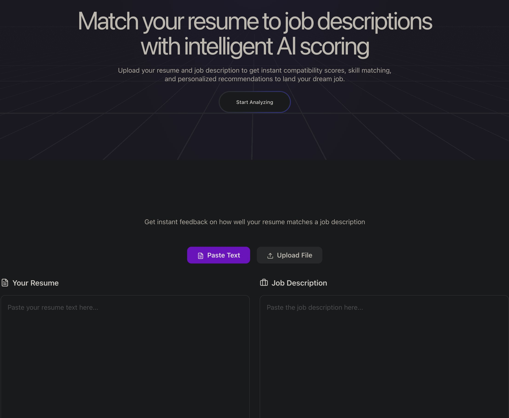
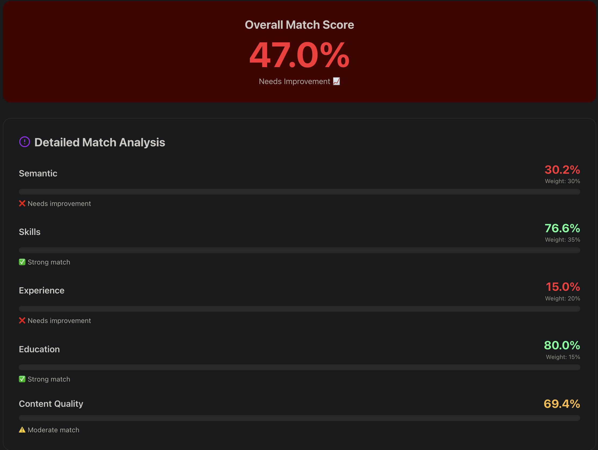
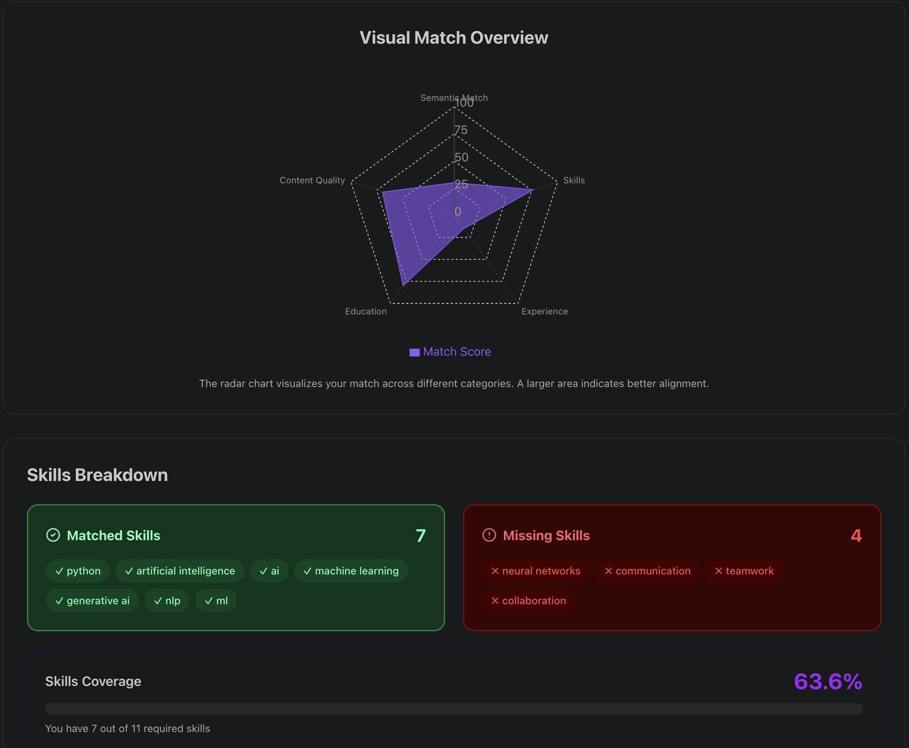
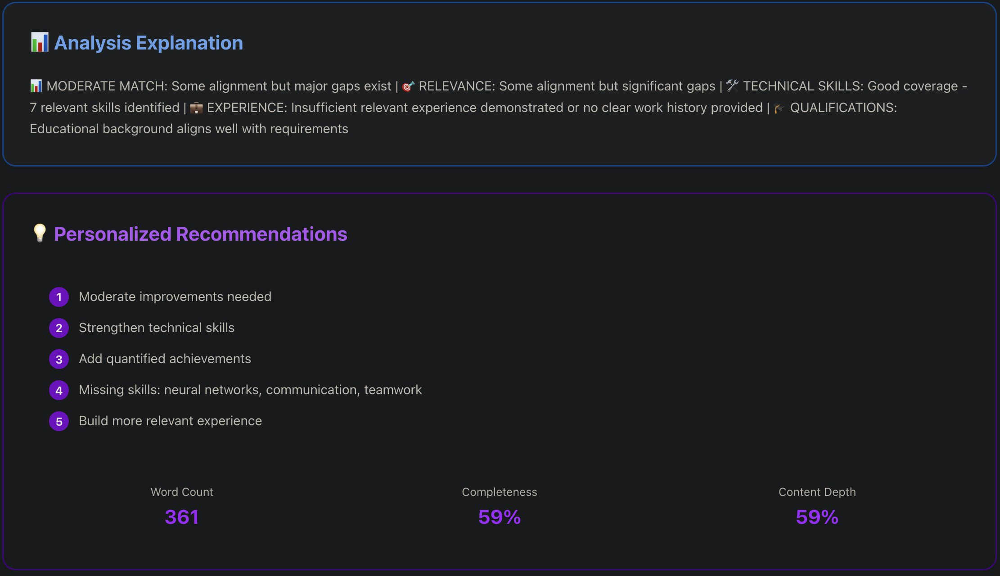

# 🎯 Resume Analyzer Pro

An AI-powered resume analysis tool that helps job seekers optimize their resumes by comparing them against job descriptions. Get instant compatibility scores, skill matching insights, and personalized recommendations.


## 📸 Screenshots

<table>
  <tr>
    <td width="50%">
      
    </td>
    <td width="50%">
      
    </td>
  </tr>
  <tr>
    <td width="50%">
      
    </td>
    <td width="50%">
      
    </td>
  </tr>
</table>

## Features

### AI-Powered Analysis
- **Semantic Matching**: Advanced NLP using sentence transformers to understand context
- **Skills Detection**: Automatically identifies technical and soft skills
- **Experience Evaluation**: Analyzes years of experience and relevance
- **Education Assessment**: Evaluates qualifications and certifications

### Comprehensive Scoring
- **Overall Match Score**: Single metric showing resume-job compatibility (0-100%)
- **Category Breakdown**: Detailed scores for semantic match, skills, experience, and education
- **Visual Insights**: Interactive radar charts and progress bars
- **Skills Coverage**: Shows matched vs. missing skills

### Multiple Input Methods
- **Text Input**: Paste resume and job description directly
- **File Upload**: Support for PDF, DOCX, and TXT formats
- **Drag & Drop**: Modern file upload interface

### Actionable Insights
- **Personalized Recommendations**: Specific suggestions to improve your resume
- **Missing Skills Highlight**: Clear identification of gaps
- **Content Quality Metrics**: Word count, completeness, and depth analysis

## Architecture

### Backend (FastAPI)
- **Framework**: FastAPI with Python 3.12+
- **ML Model**: Sentence Transformers (multi-qa-mpnet-base-dot-v1)
- **Text Extraction**: PyPDF2 (PDF), python-docx (DOCX)
- **API Design**: RESTful with automatic OpenAPI documentation

### Frontend (Next.js)
- **Framework**: Next.js 16 with App Router
- **Language**: TypeScript
- **Styling**: Tailwind CSS v4
- **Components**: shadcn/ui + custom components
- **Charts**: Recharts for data visualization
- **Icons**: Lucide React

### Alternative UI (Streamlit)
- Simple, quick-to-deploy interface
- Great for local use and prototyping

## 🚀 Quick Start

### Prerequisites
- Python 3.12 or higher
- Node.js 18 or higher
- npm or yarn

### Option 1: Docker (Recommended)

```bash
# Clone the repository
git clone https://github.com/MykytaSalykin/Resume-Analyzer.git
cd Resume-Analyzer

# Start all services with Docker Compose
docker compose up --build
```

Access the application:
- **React Frontend**: http://localhost:3000
- **FastAPI Backend**: http://localhost:8000
- **API Docs**: http://localhost:8000/docs
- **Streamlit UI**: http://localhost:8501

### Option 2: Manual Setup

#### Backend Setup

```bash
# Navigate to project directory
cd resume-analyzer

# Create virtual environment
python3 -m venv .venv
source .venv/bin/activate  # On Windows: .venv\Scripts\activate

# Install dependencies
pip install -r requirements.txt

# Start the API server
uvicorn api:app --reload --host 0.0.0.0 --port 8000
```

#### Frontend Setup

```bash
# Navigate to frontend directory
cd frontend

# Install dependencies
npm install

# Start development server
npm run dev
```

The frontend will be available at http://localhost:3000

## 📖 API Documentation

### Analyze Resume (Text)
```http
POST /analyze
Content-Type: application/json

{
  "resume_text": "Your resume text...",
  "job_description": "Job description text..."
}
```

### Analyze Resume (File)
```http
POST /analyze-file
Content-Type: multipart/form-data

resume_file: <file>
job_description: "Job description text..."
```

### Response Format
```json
{
  "overall_score": 75.5,
  "breakdown": {
    "semantic": 70.0,
    "skills": 85.0,
    "experience": 75.0,
    "education": 70.0,
    "content_quality": 80.0
  },
  "weights": {
    "semantic": 0.3,
    "skills": 0.35,
    "experience": 0.2,
    "education": 0.15
  },
  "matched_skills": ["Python", "FastAPI", "Docker"],
  "missing_skills": ["Kubernetes", "AWS"],
  "explanation": "Detailed analysis...",
  "recommendations": "Improvement suggestions...",
  "resume_insights": {
    "content_depth": 0.75,
    "word_count": 450,
    "estimated_completeness": 75
  }
}
```

Visit http://localhost:8000/docs for interactive API documentation.

## 🔧 Configuration

### Environment Variables

Create a `.env` file in the project root:

```env
# Optional: Skip embeddings model loading for faster startup
SKIP_EMBEDDINGS_LOAD=0

# Frontend (create frontend/.env.local)
NEXT_PUBLIC_API_URL=http://localhost:8000
```

### Customization

**Modify Scoring Weights** (in `app/chains/enhanced_matcher.py`):
```python
base_score = (
    semantic_score * 0.30      # Adjust these weights
    + skills_score * 0.35
    + experience_score * 0.20
    + qualifications_score * 0.15
)
```

**Add New Skills** (in `app/chains/extractors.py`):
```python
SKILL_PATTERNS = {
    "your_category": [
        r"\byour_skill\b",
        # Add more regex patterns
    ],
}
```

## 🧪 Testing

```bash
# Run all tests
pytest

# Run with coverage
pytest --cov=app tests/

# Run specific test file
pytest tests/test_enhanced_matcher.py
```

## 🐳 Docker Deployment

### Build Individual Images

```bash
# Backend
docker build -t resume-analyzer-api .

# Frontend
docker build -t resume-analyzer-frontend ./frontend
```

### Production Deployment

Update `docker-compose.yml` for production:
- Remove volume mounts
- Set environment variables
- Configure reverse proxy (nginx/traefik)
- Add SSL certificates

## 📝 License

This project is licensed under the MIT License - see the [LICENSE](LICENSE) file for details.
